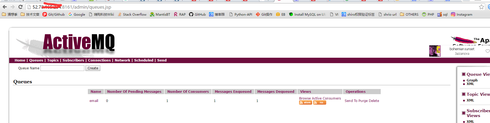
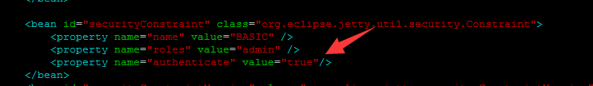

## 1下载activemq 
```
wget http://archive.apache.org/dist/activemq/apache-activemq/5.6.0/apache-activemq-5.6.0-bin.tar.gz
```
## 2.解压
```
tar zxf apache-activemq-5.6.0-bin.tar.gz
```
## 3.进入解压后的activemq/bin目录,启动mq
```
sudo ./activemq start
```
## 5.测试是否启动成功

  现在本机telnet一下端口是否正常
```
telnet 本机IP 8161
```
 再访问一下主页，一切正常！



 

更新1.0：

　　ubuntu上activemq和windows上不一样，默认登陆时不需要验证的，为了安全起见，建议修改下配置。

### 　　1.config文件夹下的jetty.xml，authenticate 值改成true
 

       2.config文件夹下的 jetty-realm.properties ，修改下用户和密码



更新1.1：
	## tcp长链接需要新增用户，/activemq/conf/activemq.xml   注意这个配置位置必须如下
	```
		  <persistenceAdapter>
            <kahaDB directory="${activemq.base}/data/kahadb"/>
        </persistenceAdapter>
        
         ==<plugins>
             <simpleAuthenticationPlugin>
                 <users>
                     <authenticationUser username="lxsoft" password="lxtest" groups="users,admins"/>
                 </users>
             </simpleAuthenticationPlugin>
         </plugins>==
        
          <!--
            The systemUsage controls the maximum amount of space the broker will 
            use before slowing down producers. For more information, see:
            
            http://activemq.apache.org/producer-flow-control.html
             
        <systemUsage>

	```