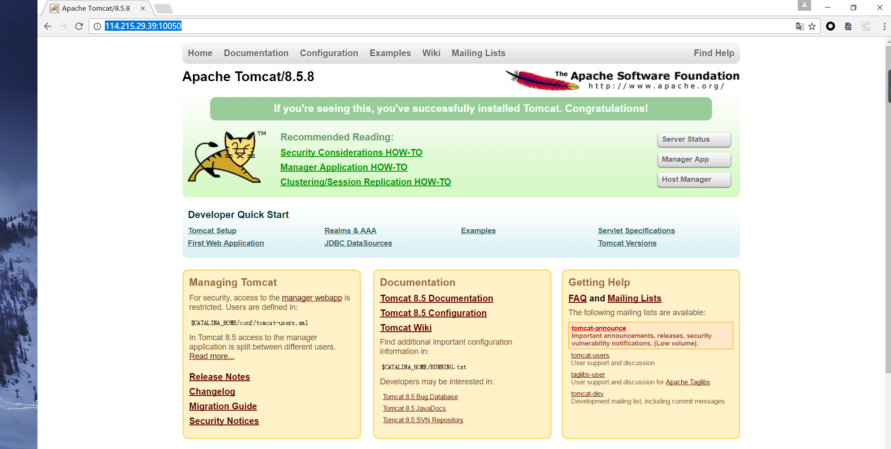

title: docker-入门
tags: 'server,linux,ubuntu'
date: 2017-04-25 13:51:49
---
以下文章了解之后你可以在服务器上部署项目，本地不需要安装 tomcat，jdk，mysql等服务器，通过docker可以一键解决	
 
 ## 快速入门
 
 
### 安装docker

```
$ apt install docker.io -y
```

若找不到资源，需要更新资源库，命令为：
``` bash
$ sudo apt-get update && sudo apt-get upgrade
```

### 查看docker版本

```
$ docker -v
```
更多的docker相关知识请关注：https://www.docker.com/

### docker安装mysql

```
$ docker pull mysql
```


### docker安装tomcat

```
$ docker pull tomcat
```

### 启动实例
docker 拉取了以上两个容器镜像之后，通过如下命令能获取到镜像列表
```
$ docker images -a
```
可以看到之前拉去到本地的两个镜像，接下来分别启动tomcat，mysql的实例，命令如下：
启动一个docker实例
```
$ sudo docker run --name image_nick_name image_name:image_tag
```

启动mysql：
```
$ sudo docker run --name mysql -p 3400:3306 -e MYSQL_ROOT_PASSWORD=123456 -d mysql:latest
``` 
启动tomcat：
```
$ sudo docker run -it -d --name tomcat tomcat:latest
``` 
在启动之后，该服务器上即可成功访问到tomcat和mysql
连接mysql：
```
$ mysql -u root -h 114.215.29.39 -P 3400  -p123456
```
访问ip：http://114.215.29.39:10050/ 即可出现如下页面：
