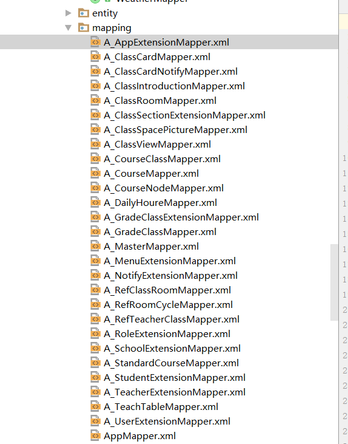

title: mybatis-generator 源码浅析与修改
author: zjy
date: 2017-12-15 14:42:59
tags:
---
# mybatis-generator 简介
		Mybatis属于半自动ORM，在使用这个框架中，工作量最大的就是书写Mapping的映射文件，由于手动书写很容易出错，我们可以利用Mybatis-Generator来帮我们自动生成文件。项目中常用的：
         StudentExample example = new StudentExample();
         StudentExample.Criteria criteria = example.createCriteria();
         deleteByExample
         insert
         insertSelective	
         selectByExample ..等等诸如此类的方法，均是通过mybatis-genenrator可以自动生成的 使得开发起来很方便。
         mybatis-generator 生成的sql xml几乎涵盖了单表的所有增删改查方法。很方便
         
# mybatis-generator 问题
（mybatis-generator默认合并指的是 123 ， 234 合并完 是 123234，而我们需要的结果是1234）
		
       1  生成一次 CourseMapper.java,CourseMapper.xml等文件。
       2  现在需要加个批量插入方法，在CouseMapper.java里加  
           public int batchInsert(List<Course> list);
           在CourseMapper.xml里加
             <insert id="batchInsert" parameterType="cc.gukeer.smartBoard.persistence.entity.Course">
                your sql
             </insert>
       3  现在数据库加了个字段a，需要对文件再次生成  我们发现，xml里面，updateByPrimaryKey 这样的方法再次生成了一次，而且CourseMapper.java里 的batchInsert 这个方法已经没有了。之前写的代码也就被覆盖了或者出现了问题。我们必须得回滚。。
           
       4 为了解决这个问题，我们不得不扩展 CourseMapper.xml 
       写 A_CourseMapper.xml 对应 CourseMapper.xml 
       写 A_CourseMapper.xml 对应 CourseMapper.xml
       并把我们的批量方法写到A_***里面，这样再次生成就不会被覆盖了。那么问题来了：
       

			
       从图中可以看到，这无疑使得我们的文件更繁多，维护更加复杂。
       
       
# 问题解决-xml合并
    出现这个问题的原因，我们主要来看一下generator的源码：
    org.mybatis.generator.api.MyBatisGenerator 的generate方法，是生成文件的一个入口。
    
    
    for (GeneratedXmlFile gxf : this.generatedXmlFiles){
      this.projects.add(gxf.getTargetProject());
      File targetFile;
      String source;
      try{
        File directory = this.shellCallback.getDirectory(gxf.getTargetProject(), gxf.getTargetPackage());
        targetFile = new File(directory, gxf.getFileName());
        if (targetFile.exists()){
          String source;
          if (gxf.isMergeable()){
            source = XmlFileMergerJaxp.getMergedSource(gxf, targetFile);
          }else if (this.shellCallback.isOverwriteEnabled()){
            String source = gxf.getFormattedContent();
            this.warnings.add(Messages.getString("Warning.11", targetFile.getAbsolutePath()));
          }else{
          String source = gxf.getFormattedContent();
            targetFile = getUniqueFileName(directory, gxf.getFileName());
            this.warnings.add(Messages.getString("Warning.2", targetFile.getAbsolutePath()));
          }
        }
        
        
  其中 有对gxf（GeneratedXmlFile） 是否合并判断，如果合并true，将新旧xml通过这个方法合并取合并得到的结果字符串，写到新的文件中。 XmlFileMergerJaxp.getMergedSource 
        
 XmlFileMergerJaxp.getMergedSource 部分代码如下：
 
        DocumentType newDocType = newDocument.getDoctype();
        ...
        List<Node> nodesToDelete = new ArrayList();
        NodeList children = existingRootElement.getChildNodes();
        int length = children.getLength();
        for (int i = 0; i < length; i++)
      {
        Node node = children.item(i);
        if (isGeneratedNode(node)) {
          nodesToDelete.add(node);
        } else if ((isWhiteSpace(node)) && (isGeneratedNode(children.item(i + 1)))) {
          nodesToDelete.add(node);
        }
      }
      for (Node node : nodesToDelete) {
        existingRootElement.removeChild(node);
      }
这里采用的是org.w3c.dom.* 来解析的新旧xml文件。我们发现，这里有对旧文件遍历，判断这个节点方法是否已经生成过。如果是已经生成 isGeneratedNode的节点，那么加入到 nodesToDelete里面，最后把它给移除。那么问题就出在这个 isGeneratedNode判断方法上

		private static boolean isGeneratedNode(Node node)
    {
      boolean rc = false;
      if ((node != null) && (node.getNodeType() == 1))
      {
        Element element = (Element)node;
        String id = element.getAttribute("id");
        if (id != null) {
          for (String prefix : MergeConstants.OLD_XML_ELEMENT_PREFIXES) {
            if (id.startsWith(prefix))
            {
              rc = true;
              break;
            }
          }
        }
        if (!rc)
        {
          NodeList children = node.getChildNodes();
          int length = children.getLength();
          for (int i = 0; i < length; i++)
          {
            Node childNode = children.item(i);
            if (!isWhiteSpace(childNode))
            {
              if (childNode.getNodeType() != 8) {
                break;
              }
              Comment comment = (Comment)childNode;
              String commentData = comment.getData();
              for (String tag : MergeConstants.OLD_ELEMENT_TAGS) {
                if (commentData.contains(tag))
                {
                  rc = true;
                  break;
                }
              }
            }
          }
        }
      }
      return rc;
    }
        
其实我们的需求是，之前有个<insert id="insertSelective">方法,又生成了<insert id="insertSelective">
,我们当然想用新的覆盖旧的，但是这里的判断显然不是根据这个id来判断的，所以这个方法返回false，<insert id="insertSelective">这个方法又会追加生成一次。
	
说到这里，我们只需要这样稍微修改一下即可：将新生成的节点列表保存为一个集合a。判断旧节点的id是否包含在这个集合a里面，如果在，那么旧的节点就删除。

具体代码如下：
        
        //获取新生成的所有xml，所有element的id列表，删除之前同名的结点
        NodeList newMethods = newRootElement.getChildNodes();
          List<String> methods = new ArrayList<String>();
          for (int i = 0; i < newMethods.getLength(); i++) {
              Node node = newMethods.item(i);
              try {
                  if (node instanceof DeferredTextImpl) {
                      continue;
                  }
                  Element ele = (Element) node;
                  methods.add(ele.getAttribute("id"));
              } catch (Exception e) {
                  //#text节点转换会异常
                  continue;
              }
              if (i == newMethods.getLength() - 1) {
                  if (isWhiteSpace(node)) {
                      break;
                  }
              }
          }
          
          	
    private static boolean isGeneratedNode(Node node, List<String> methods) {
        boolean rc = false;

        if (node != null && node.getNodeType() == Node.ELEMENT_NODE) {
            Element element = (Element) node;
            String id = element.getAttribute("id"); //$NON-NLS-1$
            if (methods.contains(id)) {
                return true;
            }

            if (id != null) {
                for (String prefix : MergeConstants.OLD_XML_ELEMENT_PREFIXES) {
                    if (id.startsWith(prefix)) {
                        rc = true;
                        break;
                    }
                }
            }
			
          
         这样我们就能实现 xml新的覆盖旧的，并且保留旧的文件里自己写的方法，达到合并的效果。
          

# 问题解决-java合并

	//和xml类似，这个是java代码合并判断代码
       for (GeneratedJavaFile gjf : this.generatedJavaFiles)
      {
        this.projects.add(gjf.getTargetProject());
        try
        {
          File directory = this.shellCallback.getDirectory(gjf.getTargetProject(), gjf.getTargetPackage());

          File targetFile = new File(directory, gjf.getFileName());
          String source;
          if (targetFile.exists()) {
            String source;
            if (this.shellCallback.isMergeSupported()){
              source = this.shellCallback.mergeJavaFile(gjf.getFormattedContent(), targetFile.getAbsolutePath(), MergeConstants.OLD_ELEMENT_TAGS, gjf.getFileEncoding());
            }else if (this.shellCallback.isOverwriteEnabled()){
              String source = gjf.getFormattedContent();
              this.warnings.add(Messages.getString("Warning.11", targetFile.getAbsolutePath()));
            } else{
            String source = gjf.getFormattedContent();
              targetFile = getUniqueFileName(directory, gjf.getFileName());

              this.warnings.add(Messages.getString("Warning.2", targetFile.getAbsolutePath()));
            }
          }
    
我们来看看java代码合并的实现：this.shellCallback.mergeJavaFile

	public String mergeJavaFile(String newFileSource, String existingFileFullPath, String[] javadocTags, String fileEncoding)
        throws ShellException
      {
        throw new UnsupportedOperationException();
      }
很遗憾，它并不支持java合并。我们需要自己实现java合并。此处参考：http://blog.csdn.net/w980994974/article/details/76904587
   直接上代码：
   

    package org.mybatis.generator.internal;

    import com.github.javaparser.JavaParser;
    import com.github.javaparser.ast.CompilationUnit;
    import com.github.javaparser.ast.ImportDeclaration;
    import com.github.javaparser.ast.Node;
    import com.github.javaparser.ast.NodeList;
    import com.github.javaparser.ast.body.FieldDeclaration;
    import com.github.javaparser.ast.body.MethodDeclaration;
    import com.github.javaparser.ast.body.TypeDeclaration;
    import org.mybatis.generator.config.MergeConstants;

    import java.io.File;
    import java.io.FileNotFoundException;
    import java.util.ArrayList;
    import java.util.HashSet;
    import java.util.List;
    import java.util.Set;

    import static org.mybatis.generator.api.dom.OutputUtilities.newLine;

    public class JavaFileMergerJaxp {
        public String getNewJavaFile(String newFileSource, String existingFileFullPath) throws FileNotFoundException {
            CompilationUnit newCompilationUnit = JavaParser.parse(newFileSource);
            CompilationUnit existingCompilationUnit = JavaParser.parse(new File(existingFileFullPath));
            return mergerFile(newCompilationUnit, existingCompilationUnit);
        }

        public String mergerFile(CompilationUnit newCompilationUnit, CompilationUnit existingCompilationUnit) {

            System.out.println("合并java代码");
            StringBuilder sb = new StringBuilder(newCompilationUnit.getPackageDeclaration().get().toString());
            newCompilationUnit.removePackageDeclaration();

            //合并imports
            NodeList<ImportDeclaration> imports = newCompilationUnit.getImports();
            imports.addAll(existingCompilationUnit.getImports());
            Set importSet = new HashSet<ImportDeclaration>();
            importSet.addAll(imports);

            NodeList<ImportDeclaration> newImports = new NodeList<ImportDeclaration>();
            newImports.addAll(importSet);
            newCompilationUnit.setImports(newImports);
            for (ImportDeclaration i : newCompilationUnit.getImports()) {
                sb.append(i.toString());
            }
            newLine(sb);
            NodeList<TypeDeclaration<?>> types = newCompilationUnit.getTypes();
            NodeList<TypeDeclaration<?>> oldTypes = existingCompilationUnit.getTypes();

            for (int i = 0; i < types.size(); i++) {
                //截取Class
                String classNameInfo = types.get(i).toString().substring(0, types.get(i).toString().indexOf("{") + 1);
                sb.append(classNameInfo);
                newLine(sb);
                newLine(sb);
                //合并fields
                List<FieldDeclaration> fields = types.get(i).getFields();
                List<FieldDeclaration> oldFields = oldTypes.get(i).getFields();
                List<FieldDeclaration> newFields = new ArrayList<FieldDeclaration>();
                HashSet<FieldDeclaration> fieldDeclarations = new HashSet<FieldDeclaration>();
                fieldDeclarations.addAll(fields);
                fieldDeclarations.addAll(oldFields);
                newFields.addAll(fieldDeclarations);
                for (FieldDeclaration f : newFields) {
                    sb.append("\t" + f.toString());
                    newLine(sb);
                    newLine(sb);
                }

                //合并methods
                List<MethodDeclaration> methods = types.get(i).getMethods();
                List<MethodDeclaration> existingMethods = oldTypes.get(i).getMethods();

                for (MethodDeclaration f : methods) {
                    String res = f.toString().replaceAll("\r\n", "\r\n\t");
                    sb.append("\t" + res);
                    newLine(sb);
                    newLine(sb);
                }

                List<String> methodList = new ArrayList<String>();
                for (MethodDeclaration m : methods) {
                    methodList.add(m.getName().toString());
                }
                methodList.add("toString");
                methodList.add("hashCode");
                methodList.add("equals");

                for (MethodDeclaration m : existingMethods) {
                    if (methodList.contains(m.getName().toString())) {
                        continue;
                    }

                    boolean flag = true;
                    for (String tag : MergeConstants.OLD_ELEMENT_TAGS) {
                        if (m.toString().contains(tag)) {
                            flag = false;
                            break;
                        }
                    }
                    if (flag) {
                        String res = m.toString().replaceAll("\r\n", "\r\n\t");
                        sb.append("\t" + res);
                        newLine(sb);
                        newLine(sb);
                    }
                }

                //判断是否有内部类
                types.get(i).getChildNodes();
                for (Node n : types.get(i).getChildNodes()) {
                    if (n.toString().contains("static class")) {
                        String res = n.toString().replaceAll("\r\n", "\r\n\t");
                        sb.append("\t" + res);
                    }
                }

            }

            return sb.append(System.getProperty("line.separator") + "}").toString();
        }

    }

    
   参考 上面网址得到的代码稍微加了一些新旧方法的判断，逻辑和xml合并类似。不再赘述。
   
   ps：其中java，xml是覆盖模式，还是合并模式，通过配置实现，
   
      <context id="MySQLTables" targetRuntime="MyBatis3">
       <!--true为合并，false为覆盖，新生成的文件会完全覆盖旧文件-->
        <property name="xmlMergeable" value="true" />
        <property name="javaMergeable" value="true" />
        
   
   # 总结
    
源码修改好了之后，jar包下载地址：
    http://download.csdn.net/download/zjy1211079133/10159514
    
    
## 使用方法：（下载jar包，替换你本地的pom使用的jar包 mybatis-generator-core-version.jar）
    
pom.xml配置：

 			 <plugin>
  			<groupId>org.mybatis.generator</groupId>
                  <artifactId>mybatis-generator-maven-plugin</artifactId>
                  <version>1.3.2</version>
                  <configuration>
                      <configurationFile>src/main/resources/mybatis-generator.xml</configurationFile>
                      <verbose>true</verbose>
                      <overwrite>true</overwrite>
                  </configuration>
              </plugin>
              
 mybatis-generator.xml 配置：（其他公用配置自行百度）
 
 		
         <context id="MySQLTables" targetRuntime="MyBatis3">
       <!--true为合并，false为覆盖，新生成的文件会完全覆盖旧文件-->
        <property name="xmlMergeable" value="true" />
        <property name="javaMergeable" value="true" />

生成即可。具体参照：http://blog.csdn.net/isea533/article/details/42102297 使用