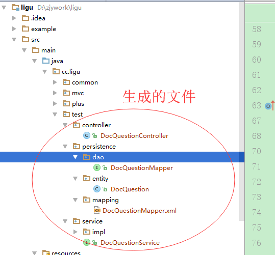

title: mybatis-plus代码生成步骤
author: zjy
date: 2018-05-31 13:58:24
tags:
---
# 1 pom文件

pom文件添加如下依赖
          
          <!-- https://mvnreository.com/artifact/com.baomidou/mybatis-plus -->
              <dependency>
                  <groupId>com.baomidou</groupId>
                  <artifactId>mybatis-plus</artifactId>
                  <version>2.1.9</version>
              </dependency>
              
# 2 配置文件 mybatis-plus.properties
	#此处为本项目src所在路径（代码生成器输出路径）
    outputDir=D:\\zjywork\\ligu\\src\\main\\java

    #下面为各个代码生成的包路径
    entity.path=cc.ligu.test.persistence.entity
    mapper.path=cc.ligu.test.persistence.dao
    xml.path=cc.ligu.test.persistence.mapping
    service.path=cc.ligu.test.service
    serviceImpl.path=cc.ligu.test.service.impl
    controller.path=cc.ligu.test.controller

    #各个文件生成的文件名格式(例如：mapper.配置成:DTO%sMapper,就会生成：DTOUserMapper.java这样。%s是必要配置)
    mapper.name=%sMapper
    xml.name=%sMapper
    service.name=%sService
    serviceImpl.name=%sServiceImpl
    controller.name=%sController

    #数据库表名(此处如果为空，则默认读取数据库的所有表名，)
    tableName=doc_question,doc_source

    #代码生成的注释的作者
    author=zjy

    #数据库参数
    jdbc.driver=com.mysql.jdbc.Driver
    jdbc.url=jdbc:mysql://127.0.0.1:3308/test?useUnicode=true&characterEncoding=utf-8&useJDBCCompliantTimezoneShift=true&useLegacyDatetimeCode=false&serverTimezone=UTC&useSSL=false
    jdbc.userName=root
    jdbc.password=test
    
# 3 生成入口 MyBatisPlusGenerator.java

	package cc.ligu.mvc.common;

      import java.io.InputStream;
      import java.util.HashMap;
      import java.util.Map;
      import java.util.Properties;

      import com.baomidou.mybatisplus.generator.AutoGenerator;
      import com.baomidou.mybatisplus.generator.InjectionConfig;
      import com.baomidou.mybatisplus.generator.config.DataSourceConfig;
      import com.baomidou.mybatisplus.generator.config.GlobalConfig;
      import com.baomidou.mybatisplus.generator.config.PackageConfig;
      import com.baomidou.mybatisplus.generator.config.StrategyConfig;
      import com.baomidou.mybatisplus.generator.config.converts.MySqlTypeConvert;
      import com.baomidou.mybatisplus.generator.config.converts.OracleTypeConvert;
      import com.baomidou.mybatisplus.generator.config.rules.DbColumnType;
      import com.baomidou.mybatisplus.generator.config.rules.DbType;
      import com.baomidou.mybatisplus.generator.config.rules.NamingStrategy;
      import org.springframework.core.io.ClassPathResource;

      /**
       * mybatis-plus代码生成器(用于生成entity) 
       */
      public class MyBatisPlusGenerator {

          public static Properties getProperties(String path) {
              Properties prop = null;
              InputStream inStream = null;
              try {
                  prop = new Properties();
                  inStream = new ClassPathResource(path).getInputStream();
                  prop.load(inStream);
                  inStream.close();
              } catch (Exception e) {
                  e.printStackTrace();
              }
              return prop;
          }

          public static void main(String[] args) {
              Properties properties = getProperties("mybatis-plus.properties");
              AutoGenerator mpg = new AutoGenerator();

              // 全局配置
              GlobalConfig gc = new GlobalConfig();
              gc.setOutputDir(properties.getProperty("outputDir"));// 自己的java目录
              gc.setFileOverride(true);// 是否覆盖
              gc.setActiveRecord(true);
              gc.setEnableCache(false);// XML 二级缓存
              gc.setBaseResultMap(true);// XML ResultMap
              gc.setBaseColumnList(false);// XML columList
              gc.setAuthor(properties.getProperty("author"));
              gc .setMapperName(properties.getProperty("mapper.name"))
                      .setXmlName(properties.getProperty("xml.name"))
                      .setServiceName(properties.getProperty("service.name"))
                      .setServiceImplName(properties.getProperty("serviceImpl.name"))
                      .setControllerName(properties.getProperty("controller.name"));
              mpg.setGlobalConfig(gc);

              // 数据源配置
              DataSourceConfig dsc = new DataSourceConfig();
              dsc.setDbType(DbType.MYSQL);
              dsc.setTypeConvert(new MySqlTypeConvert() {
                  // 自定义数据库表字段类型转换【可选】
                  @Override
                  public DbColumnType processTypeConvert(String fieldType) {
                      return super.processTypeConvert(fieldType);
                  }
              });
              /**数据库配置这块可以自己手写读取配置文件里的配置项，为了省事我直接copy**/
              dsc.setDriverName(properties.getProperty("jdbc.driver"));
              dsc.setUsername(properties.getProperty("jdbc.userName"));
              dsc.setPassword(properties.getProperty("jdbc.password"));
              dsc.setUrl(properties.getProperty("jdbc.url"));
              mpg.setDataSource(dsc);

              // 策略配置
              StrategyConfig strategy = new StrategyConfig();
              // strategy.setTablePrefix(new String[]{"_"});// 此处修改为表前缀
              strategy.setNaming(NamingStrategy.underline_to_camel).setInclude(properties.getProperty("tableName").split(","));// 表名生成策略
              mpg.setStrategy(strategy);
              // 包配置
              PackageConfig pc = new PackageConfig();
              pc.setParent(null);
              pc.setEntity(properties.getProperty("entity.path"));
              pc.setMapper(properties.getProperty("mapper.path"));
              pc.setXml(properties.getProperty("xml.path"));
              pc.setService(properties.getProperty("service.path"));
              pc.setServiceImpl(properties.getProperty("serviceImpl.path"));
              pc.setController(properties.getProperty("controller.path"));
              mpg.setPackageInfo(pc);

              // 注入自定义配置，可以在 VM 中使用 cfg.abc 设置的值
              InjectionConfig cfg = new InjectionConfig() {
                  @Override
                  public void initMap() {
                      Map<String, Object> map = new HashMap<>();
                      map.put("abc", this.getConfig().getGlobalConfig().getAuthor() + "-mp");
                      this.setMap(map);
                  }
              };
              mpg.setCfg(cfg);

              // 执行生成
              mpg.execute();

              // 打印注入设置
              System.err.println(mpg.getCfg().getMap().get("abc"));
          }

      }

# 4效果图

# ps:集成spring-mvc的时候需要注意的地方

## pom文件这两个依赖删除掉，否则会冲突
	 <!-- https://mvnrepository.com/artifact/org.mybatis/mybatis -->
        <dependency>
            <groupId>org.mybatis</groupId>
            <artifactId>mybatis</artifactId>
            <version>3.4.1</version>
        </dependency>

        <!-- https://mvnrepository.com/artifact/org.mybatis/mybatis-spring -->
        <dependency>
            <groupId>org.mybatis</groupId>
            <artifactId>mybatis-spring</artifactId>
            <version>1.3.0</version>
        </dependency>
        
        <!--删除上面两个依赖，用下面这个依赖代替 -->
         <!-- https://mvnreository.com/artifact/com.baomidou/mybatis-plus -->
        <dependency>
            <groupId>com.baomidou</groupId>
            <artifactId>mybatis-plus</artifactId>
            <version>2.1.9</version>
        </dependency>
        
## spirng-mybatis.xml配置,下面是局部配置，你自己的项目只需要把sqlSessionFactory 这个bean的class给换一下就行了，之前可能是：org.mybatis.spring.SqlSessionFactoryBean，把这个换成com.baomidou.mybatisplus.spring.MybatisSqlSessionFactoryBean
            <bean id="sqlSessionFactory" class="com.baomidou.mybatisplus.spring.MybatisSqlSessionFactoryBean">
            <property name="dataSource" ref="dataSource"/>
            <!-- scan xml file -->
            <property name="mapperLocations" value="classpath:cc/ligu/**/persistence/mapping/*.xml"></property>
            <property name="typeAliasesPackage" value="cc.ligu.**.persistence.entity"/>
            <property name="configLocation" value="classpath:mybatis-config.xml"></property>
            <property name="globalConfig" ref="globalConfig" />
            <property name="plugins">
                <array>
                    <!-- 分页插件配置 -->
                    <bean id="paginationInterceptor"
                          class="com.baomidou.mybatisplus.plugins.PaginationInterceptor">
                        <property name="dialectType" value="mysql" />
                    </bean>
                    <bean id="performanceInterceptor"
                          class="com.baomidou.mybatisplus.plugins.PerformanceInterceptor" >
                        <!-- 超过自动停止运行，有助于发现问题。 -->
                        <property name="maxTime" value="100" />
                        <!--SQL是否格式化 默认false-->
                        <property name="format" value="true" />
                    </bean>
                </array>
            </property>
        </bean>

        <bean id="globalConfig" class="com.baomidou.mybatisplus.entity.GlobalConfiguration">
            <property name="idType" value="2" />
            <property name="dbColumnUnderline" value="true" />
            <property name="dbType" value="mysql"/>
        </bean>