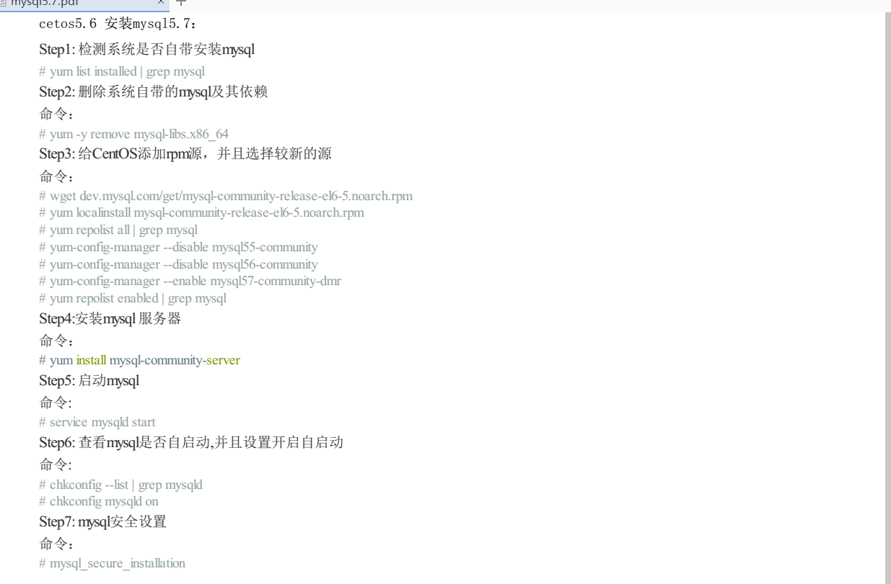
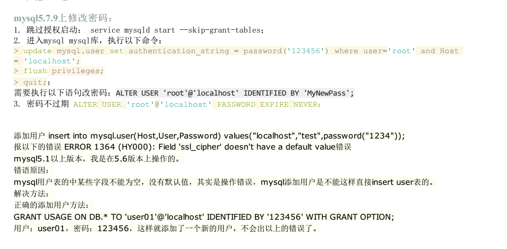

title: ubuntu14.04  - mysql5.7
tags: 'server,linux,ubuntu'
date: 2017-05-05 13:51:49
---
# 服务器装mysql

### 1：更新服务器  
	sudo apt-get update && sudo apt-get upgrade

### 2：安装mysql-server 
	
    apt-get install mysql-server

### 3 修改远程访问限制：
 #### 3.1 修改bind—address
    	在 /etc/mysql/mysql.conf.d 目录下某个文件有 bind-address属性 ，注释掉
 #### 3.2 修改host
 		mysql -u root -p;
         update mysql.user set host ="%" where user="root";
         flush privileges;
         service mysql restart;

# 相关命令

 ## 查看apt安装列表
	 dpkg  -l

## 卸载
	apt-get purge / apt-get –purge remove 
    删除已安装包（不保留配置文件)。 
    如软件包a，依赖软件包b，则执行该命令会删除a，而且不保留配置文件
    apt-get autoremove 
    删除为了满足依赖而安装的，但现在不再需要的软件包（包括已安装包），保留配置文件。
    apt-get remove 
    删除已安装的软件包（保留配置文件），不会删除依赖软件包，且保留配置文件。
    apt-get autoclean 
    APT的底层包是dpkg, 而dpkg 安装Package时, 会将 *.deb 放在 /var/cache/apt/archives/中，apt-get autoclean 只会删除 /var/cache/apt/archives/ 已经过期的deb。
    apt-get clean 
    使用 apt-get clean 会将 /var/cache/apt/archives/ 的 所有 deb 删掉，可以理解为 rm /var/cache/apt/archives/*.deb。
    
 ## 卸载异常

	subprocess pre-removal script returned error exit status... 
    处理方法如下：
        subprocess new pre-removal script returned error exit status 127 有时候也会提示 subprocess new pre-removal script returned error exit status 126

    我们反复测试得到结果：只要删除deb文件在cydia上的登记信息，该软件就等于不存在，那剩下的问题就迎刃而解了。不光是这个kuaidial，其他类似的问题应该也可以如法炮制。

    实际操作是：
    1） 首先用ifile 进入根目录下的application， 删除有问题的app，这里是kuaidial.app
    2） 进入 /var/lib/dpkg/info  找到相关文件，这里是"reyo.phone.kuaidial"删除
    3） 返回cydia，到manage里的package中，卸载问题软件（其实就是形式主义，为了删除显示是错误信息而已）
    4） 安装可用的该软件版本。

------------------------------------------------------通用-------------------------------------------------------

1  yum list installed |grep mysql
2  wget dev.mysql.com/get/mysql-community-release-el6-5.noarch.rpm
3  yum localinstall mysql-community-release-el6-5.noarch.rpm
4  yum repolist all|grep mysql
5  yum-config-manager --disable mysql55-community
6  yum-config-manager --disable mysql56-community
7  yum-config-manager --enable mysql57-community-dmr

