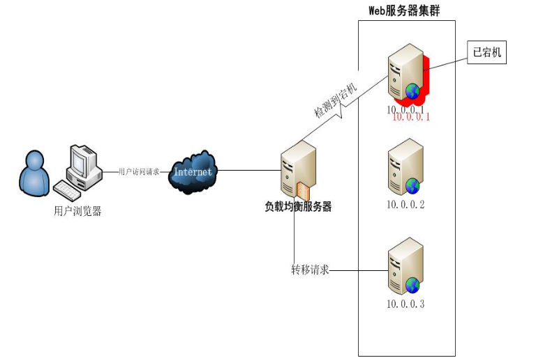
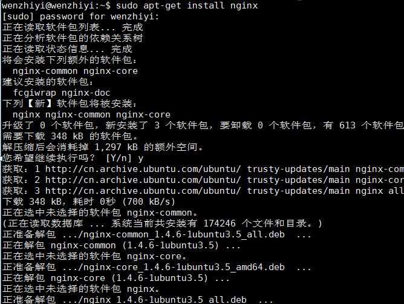
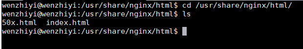
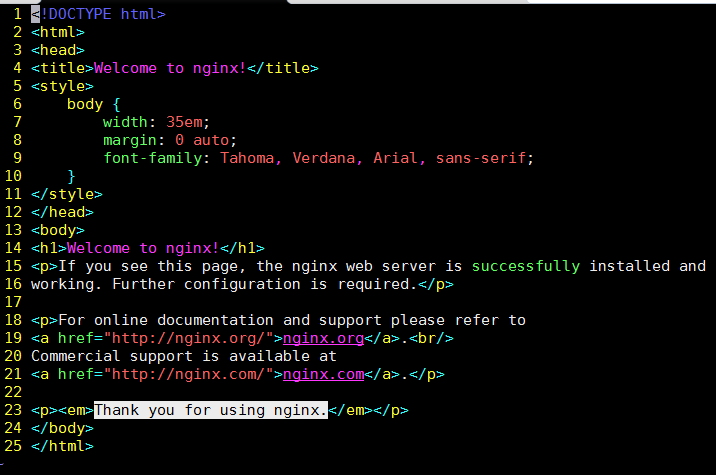
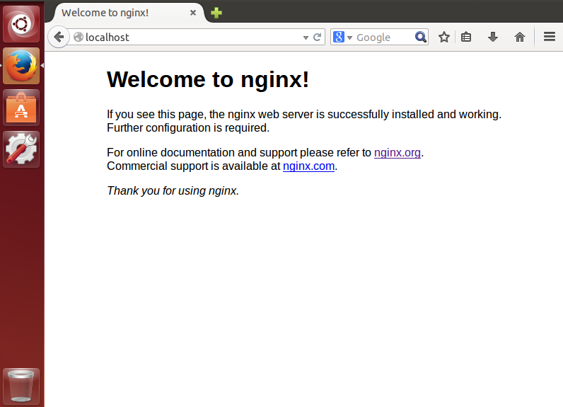
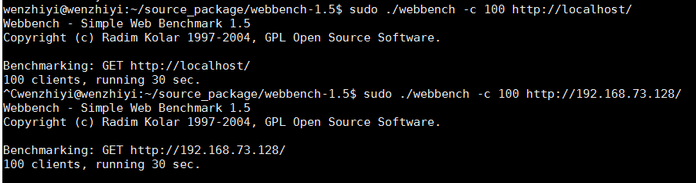

title: Nginx 安装 -ubuntu
tags: 'server,linux,ubuntu'
date: 2016-05-03 13:51:49
---
## 1、Nginx简介
Nginx是一个非常轻量级的HTTP服务器，发音为“engine X”，是一款轻量级的网页服务器、反向代理器以及电子邮件代理服务器。其将源代码以类BSD许可证的形式发布，因它的稳定性、丰富的功能集、示例配置文件和低系统资源的消耗而闻名。说到Web服务器，Apache服务器和IIS服务器是两大巨头；但是运行速度更快、更灵活的Nginx 正在迎头赶上。


## Nginx核心特点：
1. 跨平台：Nginx 可以在大多数 Unix like
2.  OS编译运行，而且也有Windows的移植版本；    
    配置异常简单：非常容易上手。配置风格跟程序开发一样，神一般的配置；
3. 非阻塞、高并发连接：数据复制时，磁盘I/O的第一阶段是非阻塞的。官方测试能够支撑5万并发连接，在实际生产环境中跑到2～3万并发连接数。（这得益于Nginx##### 使用了最新的epoll模型）；
4. 事件驱动：通信机制采用epoll模型，支持更大的并发连接；
5. Master/Worker结构：一个master进程，生成一个或多个worker进程；

##### 正向代理，工作原理就像一个跳板，用户访问不了某网站，但能通过一个代理服务器访问我不能访问的网站。

##### 反向代理：以代理服务器接受internet上的连接请求，然后将请求转发给内部网络上的服务器，并将从服务器上得到的结果返回给internet上请求连接的客户端，此时代理服务器对外就表现为一个反向代理服务器。例用户访问 http://www.baidu.com/readme，但服务器上并不存在readme页面，他是偷偷从另外一台服务器上取回来,然后作为自己的内容吐给用户但用户并不知情，对于客户端而言它就像是原始服务器，就像这些内容 原本就是它自己的一样。

##### 反向代理的最大的好处在于：负载均衡



## 2、Nginx的在线安装
 ```
 sudo apt-get install nginx
```

==ubuntu安装Nginx之后的文件结构大致为：
所有的配置文件都在/etc/nginx下，并且每个虚拟主机已经安排在了/etc/nginx/sites-available下
启动程序文件在/usr/sbin/nginx
日志放在了/var/log/nginx中，分别是access.log和error.log
并已经在/etc/init.d/下创建了启动脚本nginx
 默认的虚拟主机的目录设置在了/usr/share/nginx/html==


其html源文件是：



## 3、Nginx的在线启动/重启/停止
```
sudo /etc/init.d/nginx start/restart/stop
```
如果你的机器同时安装了Apache，那上面的访问方式就不能使用了，而且nginx都可能启动不了，这是因为它们都是用了80这个端口。我们这里将nginx的端口修改为8080，修改nginx的配置文件nginx.conf，将一下这一行listen 80;修改为 listen 8080;然后就可以访问了，http://localhost:8080/ 。



## 4、Nginx的配置
Nginx的配置文件是/etc/nginx/nginx.conf，其中设置了一些必要的参数，我们发现其中这样的语句：
 include /etc/nginx/sites-enabled/*
可以看出/etc/nginx/sites-enabled/default文件也是一个核心的配置文件，其中包含了主要的配置信息，如服务器跟目录、服务器名称、location信息和server信息，其实最主要的配置文件就是default。

## 5、用webbench对Nginx进行压测
sudo ./webbench -c 100 http://localhost




demo 配置


---
server {
  listen 80;

  server_name ynopen.wulianedu.cc;   # 请修改为你的域名

  server_tokens off;     

  
  access_log  /var/log/nginx/nginx_access.log;
  error_log   /var/log/nginx/nginx_error.log;

  location / {
    
    proxy_read_timeout 300000;  
    proxy_connect_timeout 300000; 
    proxy_redirect     off;

    proxy_set_header   X-Forwarded-Proto $scheme;
    proxy_set_header   Host              $http_host;
    proxy_set_header   X-Real-IP         $remote_addr;
    proxy_set_header   X-Forwarded-For   $proxy_add_x_forwarded_for;
    proxy_set_header   X-Frame-Options   SAMEORIGIN;

    proxy_pass http://127.0.0.1/open/;
  }

  location /open/ { 
    proxy_read_timeout 300000;  
    proxy_connect_timeout 300000; 
    proxy_redirect     off;

    proxy_set_header   X-Forwarded-Proto $scheme;
    proxy_set_header   Host              $http_host;
    proxy_set_header   X-Real-IP         $remote_addr;
    proxy_set_header   X-Forwarded-For   $proxy_add_x_forwarded_for;
    proxy_set_header   X-Frame-Options   SAMEORIGIN;

    proxy_pass http://119.23.62.150:10004/open/;
  }
}


server {
  listen 80;

  server_name ynplatform.wulianedu.cc;   # 请修改为你的域名

  server_tokens off; 
  access_log  /var/log/nginx/nginx_access.log;
  error_log   /var/log/nginx/nginx_error.log;

  location / { 
    proxy_read_timeout 300000;  
    proxy_connect_timeout 300000;  
    proxy_redirect     off;

    proxy_set_header   X-Forwarded-Proto $scheme;
    proxy_set_header   Host              $http_host;
    proxy_set_header   X-Real-IP         $remote_addr;
    proxy_set_header   X-Forwarded-For   $proxy_add_x_forwarded_for;
    proxy_set_header   X-Frame-Options   SAMEORIGIN;

    proxy_pass http://127.0.0.1/platform/;
  }

  location /platform/ { 
    proxy_read_timeout 300000;  
    proxy_connect_timeout 300000;  
    proxy_redirect     off;

    proxy_set_header   X-Forwarded-Proto $scheme;
    proxy_set_header   Host              $http_host;
    proxy_set_header   X-Real-IP         $remote_addr;
    proxy_set_header   X-Forwarded-For   $proxy_add_x_forwarded_for;
    proxy_set_header   X-Frame-Options   SAMEORIGIN;

    proxy_pass http://119.23.62.150:10001/platform/;
  }
}

报错 413 Request Entity Too Large（请求实体太大）
由于代理，若项目导入的文件大小有限制，需要更改 nginx.conf 里面的 client_max_body_size 30M; 

---