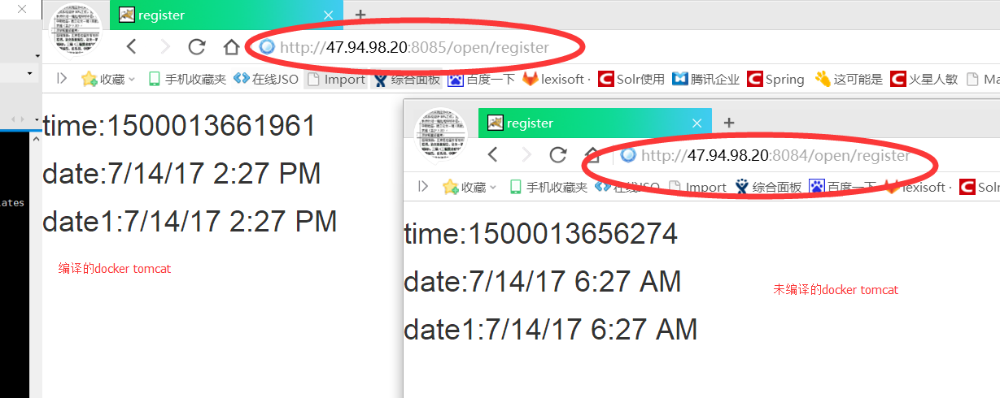
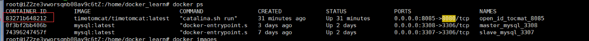
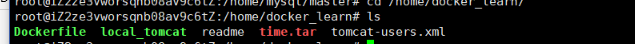
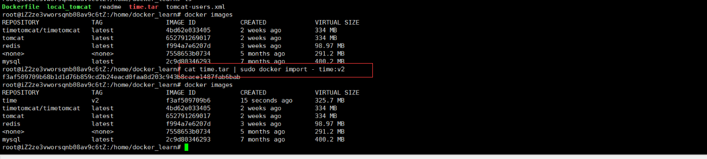

###### ---
title: docker 时区问题，迁移数据问题
date: 2017-05-05 13:51:49
tags: docker  ubuntu
---


# 问题1
```
 项目在使用docker部署的时候，发现docke容器里面的时区和服务器的时间相差8个小时。
 尽管使用 -v /etc/localtime:/etc/localtime 将服务器时间和容器挂载同步了，但是容器里的tomcat的时区仍然差8个小时。
 
```

# 说明

```

 -v /etc/localtime:/etc/localtime
    在启动的时候，使用这个命令，仅仅是将服务器和容器里系统的时间挂载了，你可能进入到容器里面再执行
“date” 命令看到，容器里面的时间的确是更改过来了，但是容器里面的tomcat运行的环境的日期，实际上仍未更改。
    因为我们在pull获取这个tomcat镜像的时候，这个tomcat容器的时区已经固定了，所以我们唯一的办法是在编译这个tomcat镜像的时候，就将本地服务器的时间和这个镜像绑定起来。

```

# 解决办法（超简单）

使用dockerFile编译镜像。 Dockerfile如下
```
        # Pull base image  
        FROM tomcat:latest  
        ENV TZ=Asia/Shanghai
        RUN ln -snf /usr/share/zoneinfo/$TZ /etc/localtime && echo $TZ > /etc/timezone
  
```
执行如下命令
```
 命令格式：
 
       $docker build -t image_name Dockerfile_path

 $:docker build -t timetomcat/timetomcat .
```
然后后边启动容器的时候，使用编译的这个tomcat即可

如图




# docker 容器迁移
说明
```
	docker部署的服务器发生变化的时候，比如数据库，想部署到一个新的地址，这些数据迁移有很多办法：
	
	针对数据库：
	1  使用mysql 的主从复制备份，在项目运行期间，将mysql服务器备份到多个地址，具体请看地址：https://zhangjy520.github.io/
	
	2  使用启动mysql的时候，使用 -v 挂载 将本地的路径和容器路径绑定，然后迁移的时候将本地的路径复制到新服务器即可
	-v /home/mysql/master/data/db-conf:/etc/mysql/ -v /home/mysql/master/data/db-data:/var/lib/mysql
	
	3  导出mysql数据库呗，再导入到新的地址，比较low
	
	4  使用docker的容器迁移。这篇博客主要讲的是docker，这里我们主要讲讲如何使用docker迁移

```


## 解决办法（超简单） 容器迁移


export  /  import
```
	源服务器上执行
	1  docker export 83271b648212 >time.tar    //导出容器，这里这个数字是容器id，会得到一个 tar压缩包
		
		解释：这个压缩包打开可以看到，其实是一个linux服务器的目录结构，这个命令将容器以及容器运行的环境打包了
	
	在目的服务器上执行
	2  cat time.tar | sudo docker import - time:v2  //导入容器，导入得到一个镜像，使用 带command /bin/bash  的docker run
		即可得到之前的容器包括文件
		
		
	启动镜像
	3  sudo docker run -itd --name import_test -p 8087:8080  time:v2 /bin/bash
```





save	/	load

```
	1  	sudo docker save web > web.tar
	
	2	sudo docker load < web.tar

```