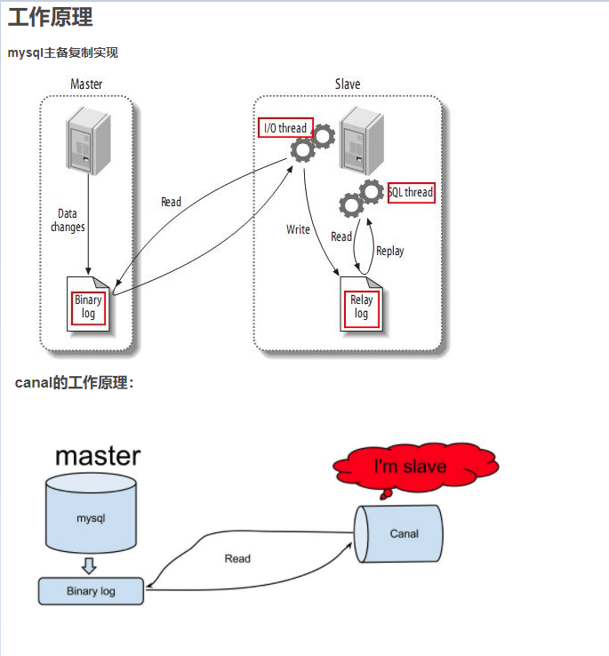

title: 异构数据库同步方案1-触发器
author: zjy
tags: []
categories: []
date: 2018-03-19 13:42:00
---
# 需求描述
		已有系统A作为基础数据提供方，有未知的一批应用app1，app2，app3.....等，需要对接到系统A的基础数据，要求数据实时异步同步，增量更新。现需要提供一套数据同步的可行性方案。
        
        
# 分析
	
    	一批未知应用对接系统A，需要实时更新，系统A运行 产生的数据变更实时同步到各个应用中。

# 设计1-触发器
	由系统A编写对接说明，具体技术实现：注解反射生成每个表对应的临时表+触发器(增删改触发器)。数据变动映射到临时表，系统A提供定时查询任务，查询各个临时表的同步状态，并推送到各个队列。第三方应用监听对应队列，各应用自行实现对应表的入库代码结构。
    
# 设计2-canal
## canal介绍
	github:https://github.com/alibaba/canal
    canal是应阿里巴巴存在杭州和美国的双机房部署，存在跨机房同步的业务需求而提出的。
      早期，阿里巴巴B2B公司因为存在杭州和美国双机房部署，存在跨机房同步的业务需求。不过早期的数据库同步业务，主要是基于trigger的方式获取增量变更，不过从2010年开始，阿里系公司开始逐步的尝试基于数据库的日志解析，获取增量变更进行同步，由此衍生出了增量订阅&消费的业务，从此开启了一段新纪元。ps. 目前内部使用的同步，已经支持mysql5.x和Oracle部分版本的日志解析
      
      基于日志增量订阅&消费支持的业务：
      
      数据库镜像
      数据库实时备份
      多级索引 (卖家和买家各自分库索引)
      search build
      业务cache刷新
      价格变化等重要业务消息
      keyword：数据库同步，增量订阅&消费
## canal 工作原理

## 部署canal服务端

部署步骤自己百度，说下需要注意的地方：canal/conf/canal.properties
  
    #network config(这里改一下超时时间,接收的数据大小kb，否则课表大量数据容易报end of stream when reading header)
    canal.instance.network.receiveBufferSize = 163840
    canal.instance.network.sendBufferSize = 163840
    canal.instance.network.soTimeout = 300

如果客户端出现了 end of stream when reading header 错误，除了改上面的配置，可以优化修改一下客户端的batchsize，因为一次取得数据过大也可能导致这个问题。客户端代码如下：