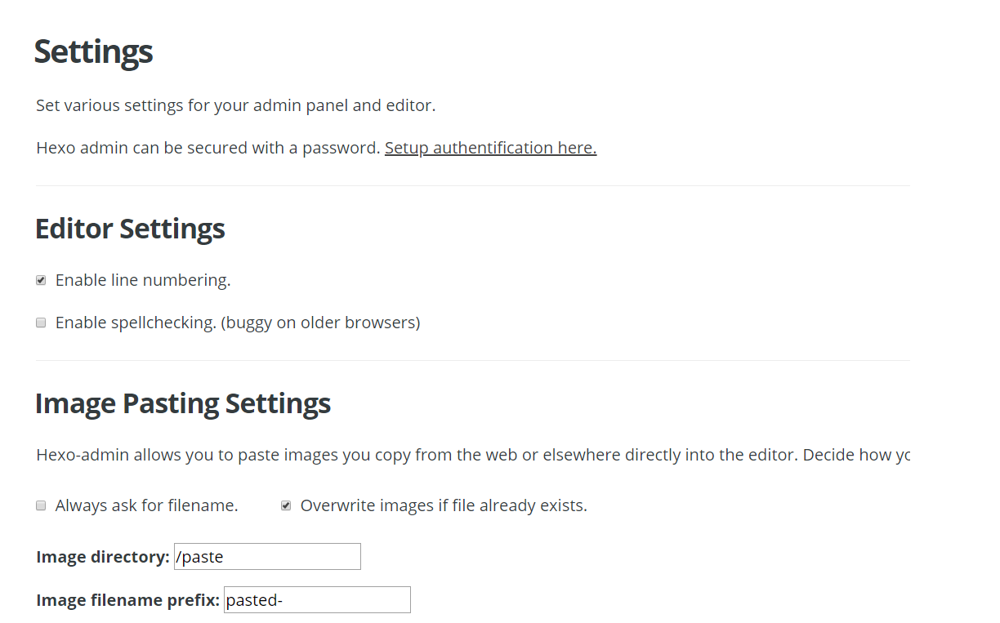

title: 怎样为我的博客添加图片
author: zjy
date: 2018-05-09 10:04:42
tags:
---
# 当前可能是最笨的方法

1 admin 的settings下面设置图片的上传地址

2 直接复制粘贴到markdown编辑器。会得到如下格式的一串代码
	
	
   
   将这串代码改成
   
	
    
然后在服务器后台/home/git_hub/blog/zjy/source/paste能看到这个图片 paste-*.png

3 在/home/git_hub/blog/zjy/source/_posts目录下新建和你的博客名字一模一样的文件夹，将图片拷贝进去
	使用 
	
    
   即可访问复制的图片
   
# 注意前面不要有斜杠！！！！