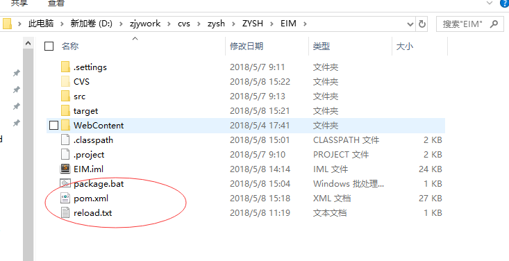

title: 批处理脚本初识
author: zjy
date: 2018-05-08 16:05:52
tags:
---
# 需求：删除定义的路径下的所有文件+文件夹

# 代码如下
## 配置文件 reload.txt内容如下
	D:\jar\com\jbns
    D:\jar\org
## 批处理文件 package.bat内容如下
	@echo off & setlocal enabledelayedexpansion
    set i=0
    for /f "eol=/delims=" %%b in (%cd%\reload.txt) do ( 
        echo %%b 
        rd /q /s %%b
        set /a "bds[!i!]=%%b",i=i+1
    ) 
    mvn clean package & pause
    
    
## 解释
	读取reload.txt文件，并且逐行删除该文件夹下的所有文件。之后进行mvn clean package的时候
    会自动去重新下载私服上最新的jar包。
    
    注意：批处理文件或者shell脚本或者python文件，在 = 赋值的时候，注意等号左右的空格。
    其中 %cd% 是当前的路径值
    
    注意：package.bat,pom.xml,reload.txt文件的路径
    
## 项目文件结构

### 最后附上pom.xml内容
	<?xml version="1.0" encoding="UTF-8"?>
      <project xmlns="http://maven.apache.org/POM/4.0.0" xmlns:xsi="http://www.w3.org/2001/XMLSchema-instance"
          xsi:schemaLocation="http://maven.apache.org/POM/4.0.0 http://maven.apache.org/xsd/maven-4.0.0.xsd">
          <modelVersion>4.0.0</modelVersion>

          <groupId>com.jbns</groupId>
          <artifactId>EIM</artifactId>
          <packaging>war</packaging>
          <version>1.0-SNAPSHOT</version>

          <properties>
              <project.build.sourceEncoding>UTF-8</project.build.sourceEncoding>
              <project.reporting.outputEncoding>UTF-8</project.reporting.outputEncoding>
              <jbns.version>1.0</jbns.version>
              <java.version>1.7</java.version>
          </properties>

          <dependencies>
              <dependency>
                  <groupId>junit</groupId>
                  <artifactId>junit</artifactId>
                  <version>3.8.1</version>
                  <scope>test</scope>
              </dependency>
              <dependency>
                  <groupId>org.activiti</groupId>
                  <artifactId>activiti-engine</artifactId>
                  <version>5.21.0</version>
              </dependency>
              <dependency>
                  <groupId>org.activiti</groupId>
                  <artifactId>activiti-bpmn-model</artifactId>
                  <version>5.21.0</version>
              </dependency>
              <dependency>
                  <groupId>org.activiti</groupId>
                  <artifactId>activiti-bpmn-converter</artifactId>
                  <version>5.21.0</version>
              </dependency>
              <dependency>
                  <groupId>org.activiti</groupId>
                  <artifactId>activiti-image-generator</artifactId>
                  <version>5.21.0</version>
              </dependency>
              <dependency>
                  <groupId>org.activiti</groupId>
                  <artifactId>activiti-process-validation</artifactId>
                  <version>5.21.0</version>
              </dependency>
              <dependency>
                  <groupId>org.activiti</groupId>
                  <artifactId>activiti-spring</artifactId>
                  <version>5.21.0</version>
              </dependency>
              <dependency>
                <groupId>org.springframework</groupId>
                <artifactId>spring-beans</artifactId>
                <version>4.3.12.RELEASE</version>
              </dependency>
              <dependency>
                  <groupId>org.springframework</groupId>
                  <artifactId>spring-aop</artifactId>
                  <version>4.3.12.RELEASE</version>
              </dependency>
              <dependency>
                <groupId>org.springframework</groupId>
                <artifactId>spring-expression</artifactId>
                <version>4.3.12.RELEASE</version>
              </dependency>
              <dependency>
                  <groupId>org.springframework</groupId>
                  <artifactId>spring-jdbc</artifactId>
                  <version>4.3.12.RELEASE</version>
              </dependency>
              <dependency>
                  <groupId>org.springframework</groupId>
                  <artifactId>spring-tx</artifactId>
                  <version>4.3.12.RELEASE</version>
              </dependency>
              <dependency>
                <groupId>org.codehaus.groovy</groupId>
                <artifactId>groovy-all</artifactId>
                <version>2.4.3</version>
              </dependency>
              <dependency>
                <groupId>commons-pool</groupId>
                <artifactId>commons-pool</artifactId>
                <version>1.6</version>
              </dependency>
              <!-- dependency>
                  <groupId>org.apache</groupId>
                  <artifactId>commons.dbcp</artifactId>
                  <version>1.2.1</version>
              </dependency -->
              <dependency>
                <groupId>commons-logging</groupId>
                <artifactId>commons-logging</artifactId>
                <version>1.2</version>
              </dependency>
              <dependency>
                <groupId>org.apache.commons</groupId>
                <artifactId>commons-lang3</artifactId>
                <version>3.6</version>
              </dependency>
              <dependency>
                <groupId>com.fasterxml.jackson.core</groupId>
                <artifactId>jackson-annotations</artifactId>
                <version>2.9.2</version>
              </dependency>
              <dependency>
                <groupId>com.fasterxml.jackson.core</groupId>
                <artifactId>jackson-core</artifactId>
                <version>2.9.2</version>
              </dependency>
              <dependency>
                <groupId>com.fasterxml.jackson.core</groupId>
                <artifactId>jackson-databind</artifactId>
                <version>2.9.2</version>
              </dependency>
              <dependency>
                  <groupId>org.slf4j</groupId>
                  <artifactId>slf4j-api</artifactId>
                  <version>1.7.25</version>
              </dependency>
              <dependency>
                <groupId>redis.clients</groupId>
                <artifactId>jedis</artifactId>
                <version>2.9.0</version>
              </dependency>
              <dependency>
                <groupId>org.springframework.data</groupId>
                <artifactId>spring-data-redis</artifactId>
                <version>1.8.8.RELEASE</version>
              </dependency>
              <dependency>
                <groupId>org.springframework.data</groupId>
                <artifactId>spring-data-keyvalue</artifactId>
                <version>1.2.8.RELEASE</version>
              </dependency>
                      <dependency>
                <groupId>org.springframework.data</groupId>
                <artifactId>spring-data-commons</artifactId>
                <version>1.13.8.RELEASE</version>
              </dependency>
              <dependency>
                <groupId>com.alibaba</groupId>
                <artifactId>druid</artifactId>
                <version>1.1.5</version>
              </dependency>
              <dependency>
                <groupId>org.mybatis</groupId>
                <artifactId>mybatis</artifactId>
                <version>3.4.5</version>
              </dependency>
              <dependency>
                <groupId>org.mybatis</groupId>
                <artifactId>mybatis-spring</artifactId>
                <version>1.3.1</version>
              </dependency>
              <dependency>
                <groupId>com.github.pagehelper</groupId>
                <artifactId>pagehelper</artifactId>
                <version>5.0.0</version>
              </dependency>
              <dependency>
                  <groupId>net.sf.jsqlparser</groupId>
                  <artifactId>jsqlparser</artifactId>
                  <version>0.9.5</version>
              </dependency>
              <dependency>
                  <groupId>org.apache.empire-db</groupId>
                  <artifactId>empire-db</artifactId>
                  <version>2.4.2</version>
              </dependency>
              <dependency>
                  <groupId>net.sf.json-lib</groupId>
                  <artifactId>json-lib</artifactId>
                  <version>2.4</version>
                  <classifier>jdk15</classifier>
              </dependency>
              <dependency>
                  <groupId>wsdl4j</groupId>
                  <artifactId>wsdl4j</artifactId>
                  <version>1.6.2</version>
              </dependency>
              <dependency>
                  <groupId>dom4j</groupId>
                  <artifactId>dom4j</artifactId>
                  <version>1.6.1</version>
                  <exclusions>  
                       <exclusion>  
                           <groupId>xml-apis</groupId>  
                           <artifactId>xml-apis</artifactId>  
                       </exclusion>  
                  </exclusions> 
              </dependency>
              <dependency>
                <groupId>axis</groupId>
                <artifactId>axis_webservice</artifactId>
                <version>1.0</version>
              </dependency>
              <dependency>
                <groupId>org.quartz-scheduler</groupId>
                <artifactId>quartz</artifactId>
                <version>2.3.0</version>
              </dependency>
              <dependency>
                <groupId>com.google.code.gson</groupId>
                <artifactId>gson</artifactId>
                <version>2.8.2</version>
              </dependency>
              <dependency>
                <groupId>org.springframework</groupId>
                <artifactId>spring-web</artifactId>
                <version>4.3.12.RELEASE</version>
              </dependency>
              <dependency>
                <groupId>org.aspectj</groupId>
                <artifactId>aspectjweaver</artifactId>
                <version>1.8.9</version>
              </dependency>
              <dependency>
                <groupId>org.beanshell</groupId>
                <artifactId>bsh</artifactId>
                <version>2.0b4</version>
              </dependency>
              <dependency>
                <groupId>org.freemarker</groupId>
                <artifactId>freemarker</artifactId>
                <version>2.3.21</version>
              </dependency>
              <dependency>
                <groupId>org.apache.shiro</groupId>
                <artifactId>shiro-all</artifactId>
                <version>1.3.2</version>
              </dependency>
              <dependency>
                <groupId>org.apache.ant</groupId>
                <artifactId>ant</artifactId>
                <version>1.10.1</version>
              </dependency>
              <dependency>
                <groupId>aopalliance</groupId>
                <artifactId>aopalliance</artifactId>
                <version>1.0</version>
              </dependency>
              <dependency>
                <groupId>com.fasterxml</groupId>
                <artifactId>classmate</artifactId>
                <version>1.3.1</version>
              </dependency>
              <dependency>
                <groupId>commons-fileupload</groupId>
                <artifactId>commons-fileupload</artifactId>
                <version>1.2</version>
              </dependency>
              <dependency>
                  <groupId>com.sun</groupId>
                  <artifactId>comm</artifactId>
                  <version>${jbns.version}</version>
              </dependency>
              <dependency>
                <groupId>commons-beanutils</groupId>
                <artifactId>commons-beanutils</artifactId>
                <version>1.9.2</version>
              </dependency>
              <dependency>
                <groupId>commons-codec</groupId>
                <artifactId>commons-codec</artifactId>
                <version>1.10</version>
              </dependency>
              <dependency>
                  <groupId>commons-collections</groupId>
                  <artifactId>commons-collections</artifactId>
                  <version>3.2.1</version>
              </dependency>
              <dependency>
                <groupId>commons-digester</groupId>
                <artifactId>commons-digester</artifactId>
                <version>2.0</version>
              </dependency>
              <dependency>
                <groupId>commons-discovery</groupId>
                <artifactId>commons-discovery</artifactId>
                <version>0.5</version>
              </dependency>
              <dependency>
                  <groupId>commons-io</groupId>
                  <artifactId>commons-io</artifactId>
                  <version>2.4</version>
              </dependency>
              <dependency>
                  <groupId>commons-lang</groupId>
                  <artifactId>commons-lang</artifactId>
                  <version>2.6</version>
              </dependency>
              <dependency>
                  <groupId>commons-net</groupId>
                  <artifactId>commons-net</artifactId>
                  <version>3.5</version>
              </dependency>
              <dependency>
                <groupId>org.apache.commons</groupId>
                <artifactId>commons-pool2</artifactId>
                <version>2.4.2</version>
              </dependency>
              <dependency>
                  <groupId>cxf</groupId>
                  <artifactId>cxf</artifactId>
                  <version>2.6.16</version>
              </dependency>
              <dependency>
                <groupId>net.sf.ezmorph</groupId>
                <artifactId>ezmorph</artifactId>
                <version>1.0.6</version>
              </dependency>
              <dependency>
                <groupId>com.alibaba</groupId>
                <artifactId>fastjson</artifactId>
                <version>1.2.40</version>
              </dependency>
              <dependency>
                <groupId>ch.ethz.ganymed</groupId>
                <artifactId>ganymed-ssh2</artifactId>
                <version>262</version>
              </dependency>
              <dependency>
                <groupId>com.google.guava</groupId>
                <artifactId>guava</artifactId>
                <version>18.0</version>
              </dependency>
              <dependency>
                <groupId>org.apache.httpcomponents</groupId>
                <artifactId>httpclient</artifactId>
                <version>4.5.4</version>
              </dependency>
              <dependency>
                <groupId>org.apache.httpcomponents</groupId>
                <artifactId>httpcore</artifactId>
                <version>4.4.7</version>
              </dependency>
              <dependency>
                <groupId>org.apache.httpcomponents</groupId>
                <artifactId>httpmime</artifactId>
                <version>4.4.1</version>
              </dependency>
              <dependency>
                <groupId>com.itextpdf</groupId>
                <artifactId>itextpdf</artifactId>
                <version>5.5.10</version>
              </dependency>
              <dependency>
                <groupId>com.itextpdf</groupId>
                <artifactId>itext-pdfa</artifactId>
                <version>5.5.10</version>
              </dependency>
              <dependency>
                <groupId>com.itextpdf</groupId>
                <artifactId>itext-xtra</artifactId>
                <version>5.5.10</version>
                <exclusions>  
                   <exclusion>  
                       <groupId>org.apache.commons</groupId>  
                       <artifactId>commons-imaging</artifactId>  
                   </exclusion>  
                </exclusions> 
              </dependency>
              <dependency>
                <groupId>org.codehaus.jackson</groupId>
                <artifactId>jackson-core-asl</artifactId>
                <version>1.9.13</version>
              </dependency>
              <dependency>
                <groupId>com.fasterxml.jackson.dataformat</groupId>
                <artifactId>jackson-dataformat-xml</artifactId>
                <version>2.9.2</version>
              </dependency>
              <dependency>
                <groupId>org.codehaus.jackson</groupId>
                <artifactId>jackson-mapper-asl</artifactId>
                <version>1.9.13</version>
              </dependency>
              <dependency>
                <groupId>com.fasterxml.jackson.module</groupId>
                <artifactId>jackson-module-jaxb-annotations</artifactId>
                <version>2.9.2</version>
              </dependency>
              <dependency>
                <groupId>javax.xml.bind</groupId>
                <artifactId>jaxb-api</artifactId>
                <version>2.3.0</version>
              </dependency>
              <dependency>
                <groupId>javax.xml</groupId>
                <artifactId>jaxb-impl</artifactId>
                <version>2.1</version>
              </dependency>
              <dependency>
                <groupId>javax.xml</groupId>
                <artifactId>jaxb-xjc</artifactId>
                <version>2.0EA3</version>
              </dependency>
              <dependency>
                <groupId>org.jdom</groupId>
                <artifactId>jaxen-core</artifactId>
                <version>1.0-FCS</version>
              </dependency>
              <dependency>
                <groupId>org.jdom</groupId>
                <artifactId>jaxen-jdom</artifactId>
                <version>1.0-FCS</version>
              </dependency>
              <dependency>
                <groupId>javax.xml.ws</groupId>
                <artifactId>jaxws-api</artifactId>
                <version>2.1</version>
              </dependency>
              <dependency>
                <groupId>org.slf4j</groupId>
                <artifactId>jcl-over-slf4j</artifactId>
                <version>1.7.25</version>
              </dependency>
              <dependency>
                <groupId>org.jdom</groupId>
                <artifactId>jdom</artifactId>
                <version>1.1</version>
              </dependency>
              <dependency>
                  <groupId>joda-time</groupId>
                  <artifactId>joda-time</artifactId>
                  <version>2.9.9</version>
              </dependency>
              <dependency>
                  <groupId>json</groupId>
                  <artifactId>json</artifactId>
                  <version>${jbns.version}</version>
              </dependency>
              <dependency>
                <groupId>javax.servlet</groupId>
                <artifactId>jstl</artifactId>
                <version>1.2</version>
              </dependency>
              <dependency>
                <groupId>org.slf4j</groupId>
                <artifactId>jul-to-slf4j</artifactId>
                <version>1.7.25</version>
              </dependency>
              <dependency>
                <groupId>log4j</groupId>
                <artifactId>log4j</artifactId>
                <version>1.2.17</version>
              </dependency>
              <dependency>
                <groupId>org.slf4j</groupId>
                <artifactId>log4j-over-slf4j</artifactId>
                <version>1.7.25</version>
              </dependency>
              <dependency>
                <groupId>ch.qos.logback</groupId>
                <artifactId>logback-classic</artifactId>
                <version>1.1.7</version>
              </dependency>
              <dependency>
                <groupId>ch.qos.logback</groupId>
                <artifactId>logback-core</artifactId>
                <version>1.1.7</version>
              </dependency>
              <dependency>
                <groupId>org.logback-extensions</groupId>
                <artifactId>logback-ext-spring</artifactId>
                <version>0.1.4</version>
              </dependency>
              <dependency>
                  <groupId>com.sun</groupId>
                  <artifactId>mail</artifactId>
                  <version>${jbns.version}</version>
              </dependency>
              <dependency>
                <groupId>org.mapstruct</groupId>
                <artifactId>mapstruct</artifactId>
                <version>1.0.0.Final</version>
              </dependency>
              <dependency>
                <groupId>net.percederberg.mibble</groupId>
                <artifactId>mibble-mibs</artifactId>
                <version>2.9.3</version>
              </dependency>
              <dependency>
                <groupId>net.percederberg.mibble</groupId>
                <artifactId>mibble-parser</artifactId>
                <version>2.9.3</version>
              </dependency>
              <dependency>
                <groupId>gephi.toolkit</groupId>
                <artifactId>gephi-toolkit</artifactId>
                <version>${jbns.version}</version>
              </dependency>
              <!-- dependency>
                  <groupId>multiTenancy</groupId>
                  <artifactId>multiTenancy</artifactId>
                  <version>${jbns.version}</version>
              </dependency -->
              <dependency>
                <groupId>mysql</groupId>
                <artifactId>mysql-connector-java</artifactId>
                <version>5.1.25</version>
              </dependency>
              <dependency>
                <groupId>org.apache.neethi</groupId>
                <artifactId>neethi</artifactId>
                <version>3.0.1</version>
              </dependency>
              <dependency>
                <groupId>com.belerweb</groupId>
                <artifactId>pinyin4j</artifactId>
                <version>2.5.1</version>
              </dependency>
              <dependency>
                <groupId>org.apache.poi</groupId>
                <artifactId>poi</artifactId>
                <version>3.9</version>
              </dependency>
              <dependency>
                <groupId>org.apache.poi</groupId>
                <artifactId>poi-contrib</artifactId>
                <version>3.2-FINAL</version>
              </dependency>
              <dependency>
                <groupId>org.apache.poi</groupId>
                <artifactId>poi-ooxml</artifactId>
                <version>3.9</version>
              </dependency>
              <dependency>
                <groupId>org.apache.poi</groupId>
                <artifactId>poi-ooxml-schemas</artifactId>
                <version>3.9</version>
              </dependency>
              <dependency>
                <groupId>org.apache.poi</groupId>
                <artifactId>poi-scratchpad</artifactId>
                <version>3.1-FINAL</version>
              </dependency>
              <dependency>
                <groupId>javax.xml.soap</groupId>
                <artifactId>saaj-api</artifactId>
                <version>1.3.5</version>
              </dependency>
              <dependency>
                <groupId>com.sun.xml.messaging.saaj</groupId>
                <artifactId>saaj-impl</artifactId>
                <version>1.4.0</version>
              </dependency>
              <dependency>
                <groupId>saxpath</groupId>
                <artifactId>saxpath</artifactId>
                <version>1.0-FCS</version>
              </dependency>
              <dependency>
                <groupId>org.slf4j</groupId>
                <artifactId>log4j-over-slf4j</artifactId>
                <version>1.7.25</version>
              </dependency>
              <dependency>
                <groupId>org.snmp4j</groupId>
                <artifactId>snmp4j</artifactId>
                <version>2.5.0</version>
              </dependency>
              <dependency>
                <groupId>org.springframework</groupId>
                <artifactId>spring-context</artifactId>
                <version>4.3.12.RELEASE</version>
              </dependency>
              <dependency>
                <groupId>org.springframework</groupId>
                <artifactId>spring-core</artifactId>
                <version>4.3.12.RELEASE</version>
              </dependency>
              <dependency>
                <groupId>io.springfox</groupId>
                <artifactId>springfox-schema</artifactId>
                <version>2.5.0</version>
              </dependency>
              <dependency>
                <groupId>io.springfox</groupId>
                <artifactId>springfox-spi</artifactId>
                <version>2.5.0</version>
              </dependency>
              <dependency>
                <groupId>io.springfox</groupId>
                <artifactId>springfox-spring-web</artifactId>
                <version>2.5.0</version>
              </dependency>
              <dependency>
                  <groupId>io.springfox</groupId>
                  <artifactId>springfox-swagger2</artifactId>
                  <version>2.5.0</version>
              </dependency>
              <dependency>
                  <groupId>io.springfox</groupId>
                  <artifactId>springfox-swagger-common</artifactId>
                  <version>2.5.0</version>
              </dependency>
              <!--需要用自己的-->
              <dependency>
                  <groupId>io.springfox</groupId>
                  <artifactId>springfox-swagger-ui</artifactId>
                  <version>2.5.0</version>
              </dependency>
              <dependency>
                <groupId>org.springframework</groupId>
                <artifactId>spring-jdbc</artifactId>
                <version>4.3.12.RELEASE</version>
              </dependency>
              <dependency>
                <groupId>org.springframework</groupId>
                <artifactId>spring-orm</artifactId>
                <version>4.3.12.RELEASE</version>
              </dependency>
              <dependency>
                <groupId>org.springframework.plugin</groupId>
                <artifactId>spring-plugin-core</artifactId>
                <version>1.2.0.RELEASE</version>
              </dependency>
              <dependency>
                <groupId>org.springframework.plugin</groupId>
                <artifactId>spring-plugin-metadata</artifactId>
                <version>1.2.0.RELEASE</version>
              </dependency>
              <!-- dependency>
                  <groupId>spring-security-config</groupId>
                  <artifactId>spring-security-config</artifactId>
                  <version>3.2.10.RELEASE</version>
              </dependency>
              <dependency>
                  <groupId>spring-security-core</groupId>
                  <artifactId>spring-security-core</artifactId>
                  <version>3.2.10.RELEASE</version>
              </dependency
              <dependency>
                  <groupId>spring-security-oauth2</groupId>
                  <artifactId>spring-security-oauth2</artifactId>
                  <version>2.1.0.RELEASE</version>
              </dependency>
              <dependency>
                  <groupId>spring-security-web</groupId>
                  <artifactId>spring-security-web</artifactId>
                  <version>3.2.10.RELEASE</version>
              </dependency -->
              <dependency>
                <groupId>org.springframework</groupId>
                <artifactId>spring-test</artifactId>
                <version>4.3.12.RELEASE</version>
              </dependency>
              <dependency>
                <groupId>org.springframework</groupId>
                <artifactId>spring-webmvc</artifactId>
                <version>4.3.12.RELEASE</version>
              </dependency>
              <!--dependency>
                  <groupId>sqljdbc4</groupId>
                  <artifactId>sqljdbc4</artifactId>
                  <version>4.0.2206.100</version>
              </dependency-->
              <dependency>
                <groupId>io.swagger</groupId>
                <artifactId>swagger-annotations</artifactId>
                <version>1.5.9</version>
              </dependency>
              <dependency>
                <groupId>io.swagger</groupId>
                <artifactId>swagger-models</artifactId>
                <version>1.5.9</version>
              </dependency>
              <dependency>
                <groupId>org.apache.tiles</groupId>
                <artifactId>tiles-api</artifactId>
                <version>3.0.8</version>
              </dependency>
              <dependency>
                <groupId>org.apache.tiles</groupId>
                <artifactId>tiles-autotag-core-runtime</artifactId>
                <version>1.2</version>
              </dependency>
              <dependency>
                <groupId>org.apache.tiles</groupId>
                <artifactId>tiles-core</artifactId>
                <version>3.0.8</version>
              </dependency>
              <dependency>
                <groupId>org.apache.tiles</groupId>
                <artifactId>tiles-jsp</artifactId>
                <version>3.0.8</version>
              </dependency>
              <dependency>
                <groupId>org.apache.tiles</groupId>
                <artifactId>tiles-request-api</artifactId>
                <version>1.0.6</version>
              </dependency>
              <dependency>
                <groupId>org.apache.tiles</groupId>
                <artifactId>tiles-request-jsp</artifactId>
                <version>1.0.6</version>
              </dependency>
              <dependency>
                <groupId>org.apache.tiles</groupId>
                <artifactId>tiles-request-servlet</artifactId>
                <version>1.0.6</version>
              </dependency>
              <dependency>
                <groupId>org.apache.tiles</groupId>
                <artifactId>tiles-servlet</artifactId>
                <version>3.0.8</version>
              </dependency>
              <dependency>
                <groupId>org.apache.tiles</groupId>
                <artifactId>tiles-template</artifactId>
                <version>3.0.8</version>
              </dependency>
              <dependency>
                  <groupId>com.baidu</groupId>
                  <artifactId>ueditor</artifactId>
                  <version>1.1.2</version>
              </dependency>
              <dependency>
                <groupId>javax.validation</groupId>
                <artifactId>validation-api</artifactId>
                <version>1.1.0.Final</version>
              </dependency>
              <dependency>
                  <groupId>org.apache</groupId>
                  <artifactId>wss4j</artifactId>
                  <version>1.6.4</version>
              </dependency>
              <dependency>
                <groupId>org.apache.xmlbeans</groupId>
                <artifactId>xmlbeans</artifactId>
                <version>2.6.0</version>
              </dependency>
              <dependency>
                <groupId>xml-resolver</groupId>
                <artifactId>xml-resolver</artifactId>
                <version>1.2</version>
              </dependency>
              <dependency>
                <groupId>org.apache.ws.xmlschema</groupId>
                <artifactId>xmlschema-core</artifactId>
                <version>2.0.1</version>
              </dependency>
              <dependency>
                <groupId>com.itextpdf.tool</groupId>
                <artifactId>xmlworker</artifactId>
                <version>5.5.6</version>
              </dependency>
              <dependency>
                  <groupId>org.apache.tomcat</groupId>
                  <artifactId>servlet-api</artifactId>
                  <version>${jbns.version}</version>
                  <scope>provided</scope>
              </dependency>
              <dependency>
                  <groupId>org.apache.tomcat</groupId>
                  <artifactId>jsp-api</artifactId>
                  <version>${jbns.version}</version>
                  <scope>provided</scope>
              </dependency>
              <dependency>
                  <groupId>com.jbns</groupId>
                  <artifactId>jbnshx-remote</artifactId>
                  <version>${jbns.version}</version>
              </dependency>

              <dependency>
                  <groupId>com.jbns</groupId>
                  <artifactId>sysmanager</artifactId>
                  <version>${jbns.version}</version>
              </dependency>
              <dependency>
                  <groupId>com.jbns</groupId>
                  <artifactId>solution</artifactId>
                  <version>${jbns.version}</version>
              </dependency>
              <dependency>
                  <groupId>com.jbns</groupId>
                  <artifactId>configmgr</artifactId>
                  <version>${jbns.version}</version>
              </dependency>
              <dependency>
                  <groupId>com.jbns</groupId>
                  <artifactId>easyitsm</artifactId>
                  <version>${jbns.version}</version>
              </dependency>

              <dependency>
                  <groupId>com.jbns</groupId>
                  <artifactId>EMIClient</artifactId>
                  <version>${jbns.version}</version>
              </dependency>
              <dependency>
                  <groupId>com.jbns</groupId>
                  <artifactId>EasyAlert</artifactId>
                  <version>${jbns.version}</version>
              </dependency>
              <dependency>
                  <groupId>com.jbns</groupId>
                  <artifactId>agent</artifactId>
                  <version>${jbns.version}</version>
              </dependency>
              <dependency>
                  <groupId>com.jbns</groupId>
                  <artifactId>api-logmgr</artifactId>
                  <version>${jbns.version}</version>
              </dependency>
              <dependency>
                  <groupId>com.jbns</groupId>
                  <artifactId>jxl</artifactId>
                  <version>${jbns.version}</version>
              </dependency>
              <dependency>
                  <groupId>com.jbns</groupId>
                  <artifactId>kernel</artifactId>
                  <version>${jbns.version}</version>
              </dependency>
              <dependency>
                  <groupId>com.jbns</groupId>
                  <artifactId>license</artifactId>
                  <version>${jbns.version}</version>
              </dependency>
              <dependency>
                  <groupId>com.jbns</groupId>
                  <artifactId>lms.node</artifactId>
                  <version>${jbns.version}</version>
              </dependency>
              <dependency>
                  <groupId>com.jbns</groupId>
                  <artifactId>mindterm</artifactId>
                  <version>${jbns.version}</version>
              </dependency>
              <dependency>
                  <groupId>com.jbns</groupId>
                  <artifactId>multiping</artifactId>
                  <version>${jbns.version}</version>
              </dependency>
              <dependency>
                  <groupId>com.sinopec</groupId>
                  <artifactId>siam-am-agent-simple</artifactId>
                  <version>3.07.RELEASE</version>
              </dependency>
          </dependencies>
          <build>
              <finalName>${project.artifactId}</finalName>
              <resources>
               <resource>
              <directory>src/main/resources</directory>
          </resource>
                  <resource>
                      <directory>src/main/java</directory>
                      <includes>
                          <include>**/*.properties</include>
                          <include>**/*.xml</include>
                          <include>**/*.tld</include>
                      </includes>
                      <filtering>false</filtering>
                  </resource>
              </resources>
              <pluginManagement>
              <plugins>

                  <!-- compiler插件, 设定JDK版本 -->
                  <plugin>
                      <groupId>org.apache.maven.plugins</groupId>
                      <artifactId>maven-compiler-plugin</artifactId>
                      <version>2.3.1</version>
                      <configuration>
                          <source>1.7</source>
                          <target>1.7</target>
                          <encoding>UTF-8</encoding>
                          <compilerArguments>
                              <verbose />
                              <bootclasspath>${env.JAVA_HOME}\jre\lib\rt.jar;${env.JAVA_HOME}\jre\lib\jce.jar</bootclasspath>
                          </compilerArguments>
                      </configuration>
                  </plugin>
                  <plugin>
                      <groupId>org.apache.maven.plugins</groupId>
                      <artifactId>maven-resources-plugin</artifactId>
                      <version>2.4.3</version>
                      <configuration>
                          <encoding>UTF-8</encoding>
                      </configuration>
                  </plugin>
                  <!-- 将scope为system的jar包拷贝到war里面 -->
                  <plugin>
                      <groupId>org.apache.maven.plugins</groupId>
                      <artifactId>maven-dependency-plugin</artifactId>
                      <version>2.7</version>
                      <executions>
                          <execution>
                              <phase>compile</phase>
                              <goals>
                                  <goal>copy-dependencies</goal>
                              </goals>
                          </execution>
                      </executions>
                      <configuration>
                          <includeScope>system</includeScope>
                          <outputDirectory>${project.build.directory}/${project.build.finalName}/WEB-INF/lib</outputDirectory>
                      </configuration>
                  </plugin>
                  <!-- war插件, 将工程打包为war包 -->
                  <plugin>
                      <artifactId>maven-war-plugin</artifactId>
                      <version>2.6</version>
                  </plugin>
              </plugins>
              </pluginManagement>
          </build>
      </project>